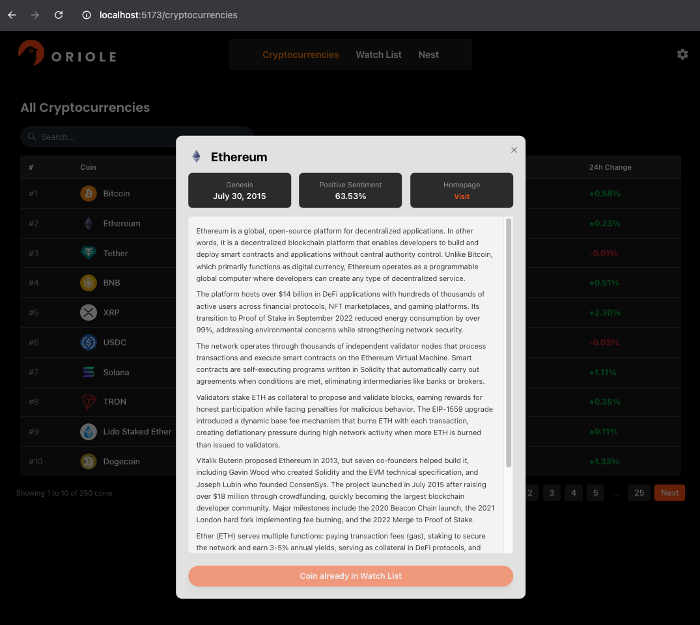
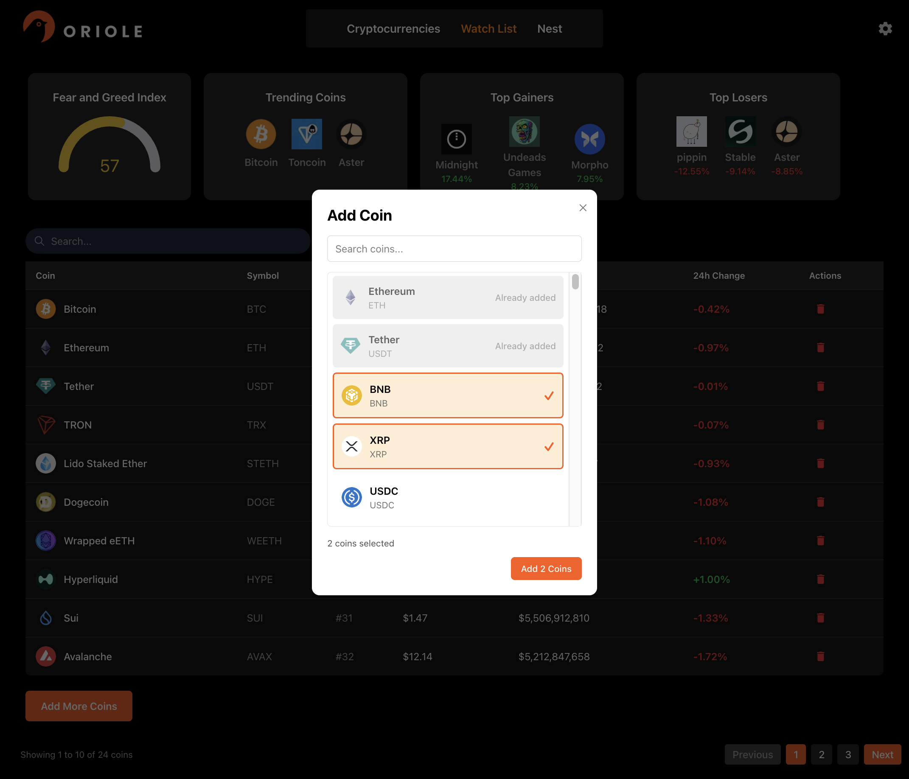
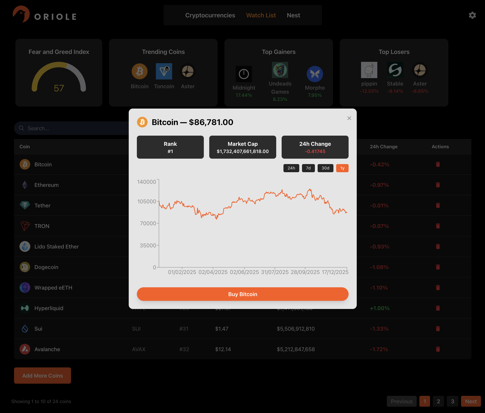
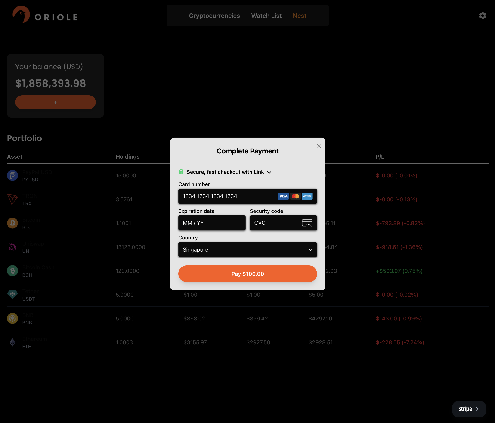

  

Live URL: <a href="https://oriole.up.railway.app/">https://oriole.up.railway.app/</a>

## Oriole

Armed with a personal goal of understanding how technology integrates with finance, I tasked myself with building a minimally functioning cryptocurrency application. This app allows you to browse the top 250 cryptocurrencies, learn more about their history, add them to a watchlist to monitor their performance, top up your wallet, and use the balance to purchase cryptocurrencies that interest you. Note that this app assumes zero transaction fees for simplicity.

## Technologies Used

- **Frontend Framework:** React + Vite
- **Backend Framework:** Node.js
- **Language:** TypeScript
- **Payment Service:** Stripe
- **Styling:** Tailwind CSS, Radix UI Library, Recharts, React Icons
- **Database:** PostgreSQL + Sequelize
- **Caching:** Redis
- **HTTP Request Library:** Axios
- **Crypto Data APIs:** CoinyBubble (Fear & Greed Index), CoinGecko (Market Data)

## A Peek into Oriole

**Browse the top 250 cryptocurrencies** and read about their history or visit the project's homepage to learn more, with the option to add coins to your watchlist for easy monitoring.

**Interested in a coin?** Add it to your watchlist to keep track of its performance.

**Keep tabs on important data such as ** the Fear & Greed Index, top gainers, top losers, and trending searches.

**Monitor market trends** for cryptocurrencies on your watchlist with interactive charts spanning different time periods.

**Top up your wallet balance** to have funds ready for purchasing cryptocurrencies and track your portfolio growth over time.

## Attributions

- [Homepage Background](https://unsplash.com/photos/black-and-white-road-during-night-time-wNsHBf_bTBo)

## Next Steps

- Revise the user journey for cryptocurrency purchases to better align with real-world trading practices
- Implement transaction fees to simulate realistic trading conditions